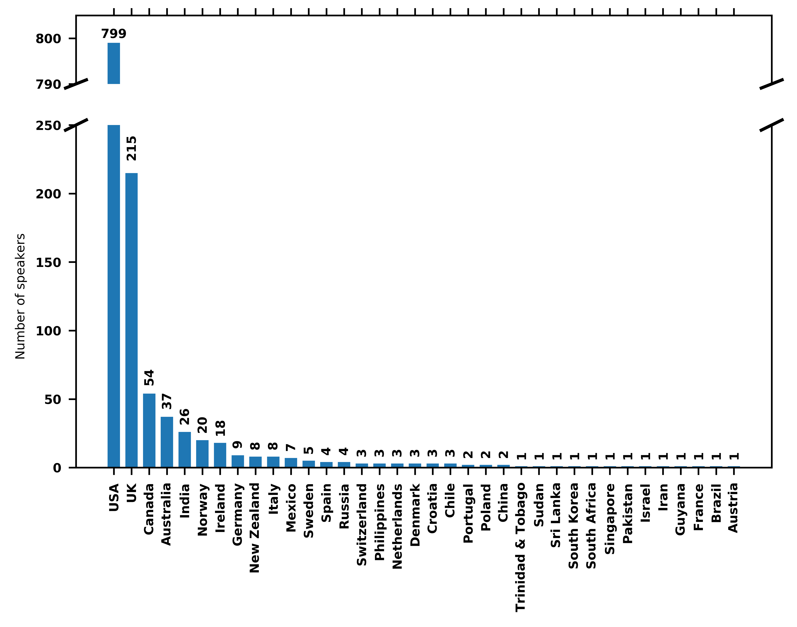

# VoxCeleb
mirror of [VoxCeleb dataset - a large-scale speaker identification dataset](http://www.robots.ox.ac.uk/~vgg/data/voxceleb/)

This repo contains the download links to the VoxCeleb dataset, described in [1]. 

VoxCeleb contains over 100,000 utterances for 1,251 celebrities, extracted from videos uploaded to YouTube. The dataset is gender balanced, with 55% of the speakers male. The speakers span a wide range of different ethnicities, accents, professions and ages. There are no overlapping identities between development and test sets.
=====================================
|	                | dev     |  test |
=====================================
|# of speakers    | 1,211   | 40    |
|# of videos      | 21,819  | 677   |
|# of utterances  | 139,124 | 6,255 |
=====================================

Nationality Distribution: The nationalities of the speakers in the dataset were obtained by crawling Wikipedia and can be found here. You can also view the distribution in the following graph:

The list of duplicates (34 videos only in the train set) can be found [here](./data/v1/duplicates.txt).

The train/val/test split used in [1] below for Speaker Identification can be found [here](./data/v1/Identification_split.txt).

Models: 
 - Pretrained models from dataset authors for VGGVox - Speaker Identification and Verification [1] can be found [here](https://github.com/a-nagrani/VGGVox).

-------

Publications:

[1] A. Nagrani, J. S. Chung, A. Zisserman - [VoxCeleb: a large-scale speaker identification dataset](./docs/2017-Nagrani-VoxCeleb_large-scale_speaker_identification_dataset.pdf) - INTERSPEECH, 2017

[2] Yifan He, Zhang Zhang - [Speaker Identication with VoxCeleb DataSet](./docs/2017-YifajHeZhangZhang-Speaker_Identication_with_VoxCeleb_DataSet-stanford_students_raport.pdf) - Stanford students project, 2017
